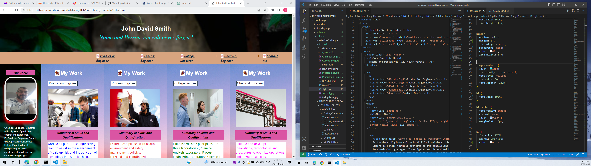

# my-Portfolio

## Description 

* This is my website I made it for the potential employer to see my work, summary of my skills and qualifications, short information about me and how to contact me.

## Contents 

* This website has My Name, How to Contact Me, link to my work as Production Engineer, Process Engineer, College Lecturer and Chemical Engineer. It has a small seaction contenet a short Paragraph of Information About Me as well.

## Installation 

* Doesn't need any instllation just hover above any link or picture then it will give you the link to that corresponding topic.

## Usage 

* It very easy to use for example if you want to know more information about my work as a Process Engineer you can use the link in the navigation bar, the link in the bottom of the Process Engineer seaction, the button above the picture of the Process Engineer or clik the picture itself.

* GitHub link to my repo.

## Credits

* 
## License
* 

## Badges
* 
## Features
* 
## How to Contribute
* 
## Test

